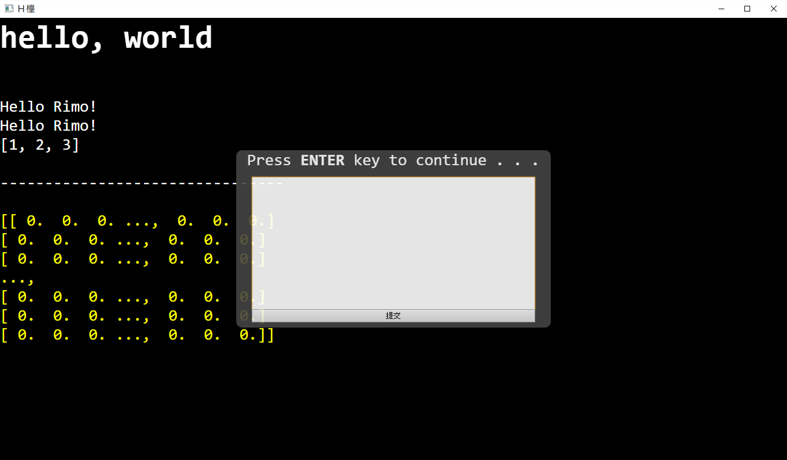

# Ｈ檯

## 简介
Ｈ檯是使用html作爲python的console。

## 使用方法

對着Ｈ檯輸出文字或者html內容就可以了。

    import htmlconsole as hc
    hc.print('<h1>hello, world</h1>')
    name = hc.input('input your name:')

類似這樣的感覺。

也可以將輸出重定向到htmlconsole.mask讓其他模組也能夠輸出到Ｈ檯。

試着運行和閱讀test.py來獲得這樣(和更多)的結果。

## 需要
+ python3
+ pip install pyqt5